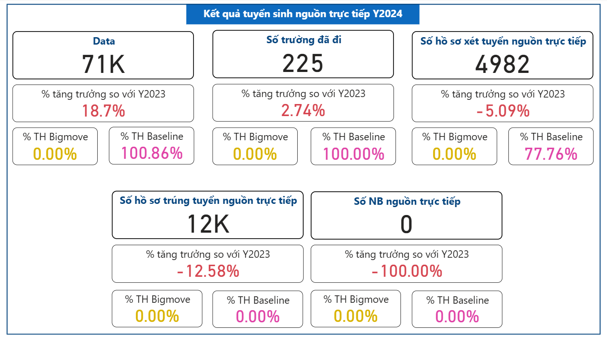
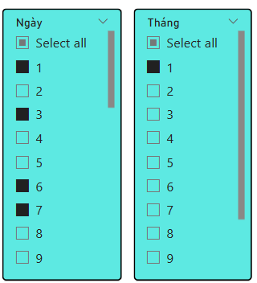
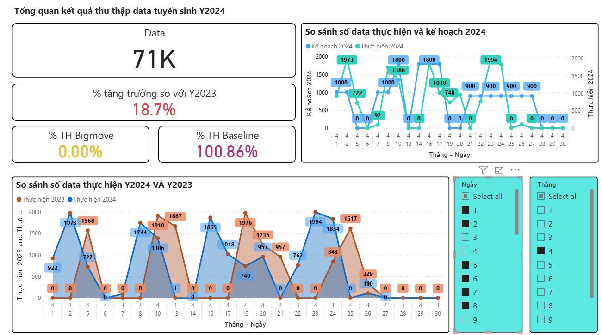
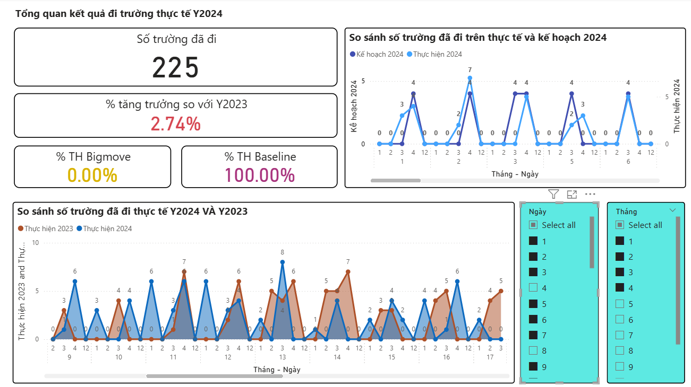
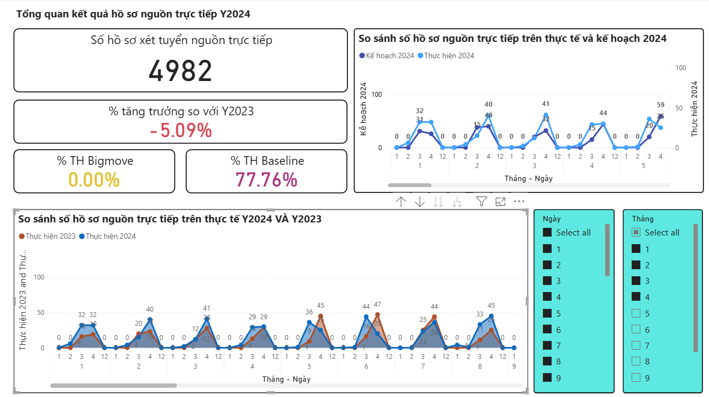
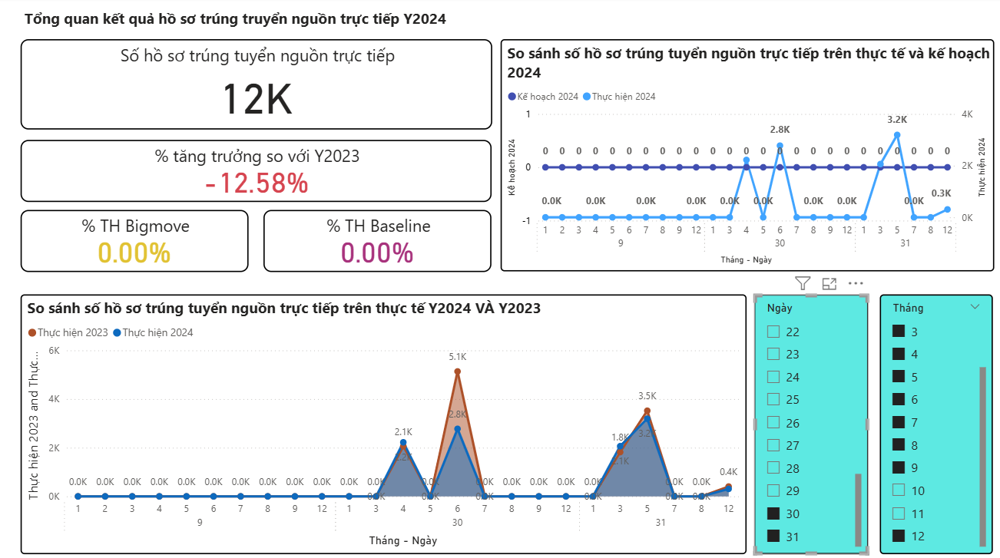

# 🎓 Admission Result Dashboard 2024

## 📊 Giới thiệu
Repo này chứa **Power BI dashboard** trực quan hóa **kết quả tuyển sinh năm 2024**.  
Dashboard giúp phòng Tuyển sinh theo dõi, phân tích và trình bày số liệu một cách trực quan.  

⚠️ Lưu ý: Dữ liệu trong file hiện tại chỉ là **demo giả lập**, không phải dữ liệu chính thức.  

---

## 🏗 Cấu trúc repo
- `TuyenSinh_Online.pbix` : File Power BI chính (mở bằng Power BI Desktop).  
- `images/` : Thư mục chứa ảnh minh họa dashboard.  
- `README.md` : Hướng dẫn sử dụng và giới thiệu repo.  

---

## 🚀 Cách sử dụng
1. Tải repo về máy:
   ```bash
   git clone https://github.com/ntphuongbusiness/cmcuni-admission2024-office-dev-dashboard.git
2. Mở file Power BI
Mở TuyenSinh_Online.pbix bằng Power BI Desktop.
- Nếu Power BI yêu cầu cập nhật đường dẫn dữ liệu, bỏ qua (vì file dùng dữ liệu demo).

3. Khám phá Dashboard
- Xem các chỉ số tuyển sinh tổng quan.
- Lọc dữ liệu theo ngày, tháng, mục đích(xem data, số trường, số hồ sơ)
- Xuất báo cáo hoặc chụp ảnh màn hình để phục vụ báo cáo nhanh.

---
## 🖼 Ảnh minh họa Dashboard
- **TRANG TỔNG QUAN**


- **CHẾ ĐỘ LỌC: THEO NGÀY/THÁNG**


- **SỐ DATA (PHIẾU THÔNG TIN) THU ĐƯỢC**


- **SỐ TRƯỜNG ĐÃ ĐI TUYỂN SINH**


- **SỐ HỒ SƠ NGUỒN TRỰC TIẾP**


- **SỐ HỒ SƠ TRÚNG TUYỂN NGUỒN TRỰC TIẾP**


---
## 📌 Ghi chú

- Repo này phục vụ mục đích demo & trình bày cho phòng Tuyển sinh.

- Khi triển khai chính thức, dữ liệu thật sẽ được kết nối và cập nhật trực tiếp.
